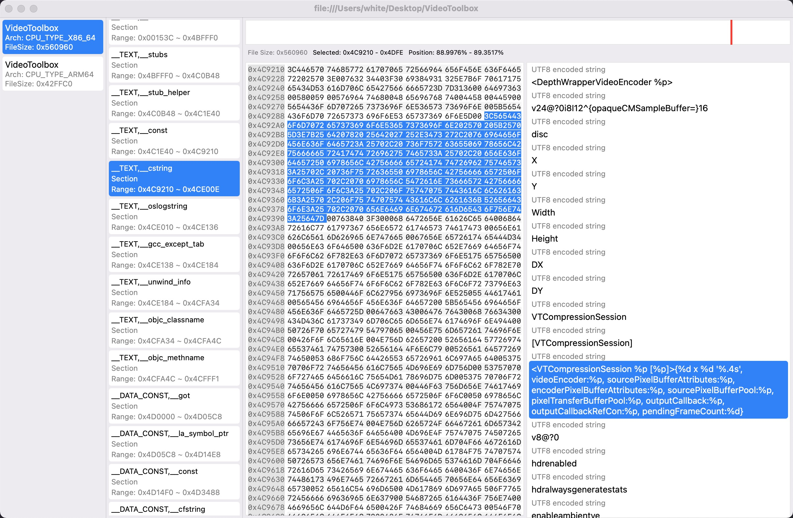

### Mocha explains every bit of your mach-o files.

Requirement:
Xcode: 13.\*, macOS 13.\*

It's written in SwiftUI, so it requires the latest version of Xcode and macOS.

It'll be an alternative of MachOViewer, but newer, better, simpler, and most importantly, compilable.

#### Features:
- A list showing all load commands, sections and all other parts of the mach-o file
- A hex view showing the raw bytes of the selected section
- A readable explanation of the selected section, if possible
- A mini map showing the position of the selected section
- Upon selection of an explanation, the hex view will auto scroll to the right position and highlight the coresponding bytes

#### Notes:
This project is still in development.

#### Progress:

✅: Done
⌛️: Not explained yet
🔨: Done but need better explanations

|  Macho Component   | Supported  |
|  ----  | ----  |
| Macho Header  | ✅ |

|  Load Command   | Supported  |
|  ----  | ----  |
| LC_SEGMENT | ✅ |        
| LC_SYMTAB | ⌛️ |        
| LC_SYMSEG | ⌛️ |        
| LC_THREAD | ⌛️ |        
| LC_UNIXTHREAD | ⌛️ |        
| LC_LOADFVMLIB | ⌛️ |        
| LC_IDFVMLIB | ⌛️ |        
| LC_IDENT | ⌛️ |        
| LC_FVMFILE | ⌛️ |        
| LC_PREPAGE | ⌛️ |        
| LC_DYSYMTAB | ⌛️ |        
| LC_LOAD_DYLIB | ⌛️ |        
| LC_ID_DYLIB | ⌛️ |        
| LC_LOAD_DYLINKER | ⌛️ |        
| LC_ID_DYLINKER | ⌛️ |        
| LC_PREBOUND_DYLIB | ⌛️ |        
| LC_ROUTINES | ⌛️ |        
| LC_SUB_FRAMEWORK | ⌛️ |        
| LC_SUB_UMBRELLA | ⌛️ |        
| LC_SUB_CLIENT | ⌛️ |        
| LC_SUB_LIBRARY | ⌛️ |        
| LC_TWOLEVEL_HINTS | ⌛️ |        
| LC_PREBIND_CKSUM | ⌛️ |        
| LC_LOAD_WEAK_DYLIB | ✅ |        
| LC_SEGMENT_64 | ✅ |        
| LC_ROUTINES_64 | ⌛️ |        
| LC_UUID | ✅ |        
| LC_RPATH | ✅ |        
| LC_CODE_SIGNATURE | ⌛️ |        
| LC_SEGMENT_SPLIT_INFO | ⌛️ |        
| LC_REEXPORT_DYLIB | ⌛️ |        
| LC_LAZY_LOAD_DYLIB | ⌛️ |        
| LC_ENCRYPTION_INFO | ✅ |        
| LC_DYLD_INFO | ⌛️ |        
| LC_DYLD_INFO_ONLY | ⌛️ |        
| LC_LOAD_UPWARD_DYLIB | ⌛️ |        
| LC_VERSION_MIN_MACOSX | ✅ |        
| LC_VERSION_MIN_IPHONEOS | ✅ |        
| LC_FUNCTION_STARTS | ✅ |        
| LC_DYLD_ENVIRONMENT | ⌛️ |        
| LC_MAIN | ⌛️ |        
| LC_DATA_IN_CODE | ⌛️ |        
| LC_SOURCE_VERSION | ✅ |        
| LC_DYLIB_CODE_SIGN_DRS | ⌛️ |        
| LC_ENCRYPTION_INFO_64 | ✅ |        
| LC_LINKER_OPTION | ✅ |        
| LC_LINKER_OPTIMIZATION_HINT | ⌛️ |        
| LC_VERSION_MIN_TVOS | ✅ |        
| LC_VERSION_MIN_WATCHOS | ✅ |        
| LC_NOTE | ⌛️ |        
| LC_BUILD_VERSION | ✅ |        
| LC_DYLD_EXPORTS_TRIE | ⌛️ |        
| LC_DYLD_CHAINED_FIXUPS | ⌛️ |        
| LC_FILESET_ENTRY | ⌛️ |

| Section Type | Supported |
|  ----  | ----  |
| S_REGULAR | ✅ |
| S_ZEROFILL | ✅ |
| S_CSTRING_LITERALS | ✅ |
| S_4BYTE_LITERALS | ⏳ |
| S_8BYTE_LITERALS | ⏳ |
| S_LITERAL_POINTERS | ✅ |
| S_NON_LAZY_SYMBOL_POINTERS | ⏳ |
| S_LAZY_SYMBOL_POINTERS | ⏳ |
| S_SYMBOL_STUBS | ⏳ |
| S_MOD_INIT_FUNC_POINTERS | ⏳ |
| S_MOD_TERM_FUNC_POINTERS | ⏳ |
| S_COALESCED | ⏳ |
| S_GB_ZEROFILL | ⏳ |
| S_INTERPOSING | ⏳ |
| S_16BYTE_LITERALS | ⏳ |
| S_DTRACE_DOF | ⏳ |
| S_LAZY_DYLIB_SYMBOL_POINTERS | ⏳ |
| S_THREAD_LOCAL_REGULAR | ⏳ |
| S_THREAD_LOCAL_ZEROFILL | ⏳ |
| S_THREAD_LOCAL_VARIABLES | ⏳ |
| S_THREAD_LOCAL_VARIABLE_POINTERS | ⏳ |
| S_THREAD_LOCAL_INIT_FUNCTION_POINTERS | ⏳ |
| S_INIT_FUNC_OFFSETS  | ⏳ |

| Other Section | Supported |
| \_\_TEXT,\_\_ustring  | ✅ |

| LinkedIT Type   | Supported  |
|  ----  | ----  |
| Rebase Info  | ✅ |
| Binding Info  | ✅ |
| Weak Binding Info  | ✅ |
| Lazy Binding Info  | ✅ |
| Export Info  | ✅ |
| String Table  | ✅ |
| Symbol Table  | ✅ 🔨 |
| Code Signature  | ✅ |
